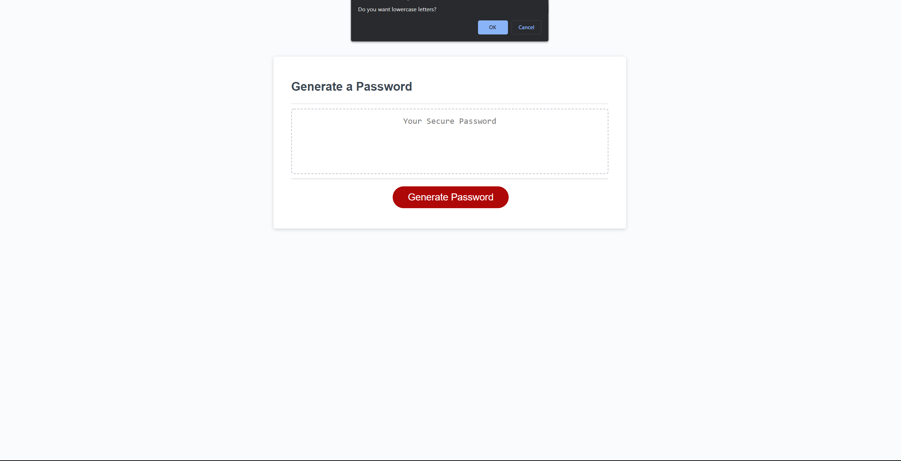
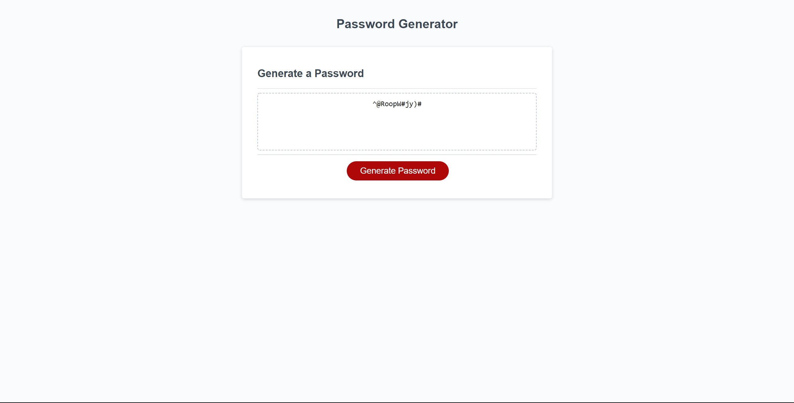

# 03 JavaScript: Password Generator

Create an application that generates a random password based on user-selected criteria. The app runs in the browser and features dynamically updated HTML and CSS powered by your JavaScript code. It has a clean and polished user interface and is responsive, which ensures that it adapts to multiple screen sizes.

Used prompts to gather user input for options like: password length and types of characters in the password. 

Deployed Project: 

GitHub Repository Link: 

I also added a 2nd program just tinkering with it and I might as well add it since I have it! 

Deployed Project 2:

GitHub Repository 2 Link:

